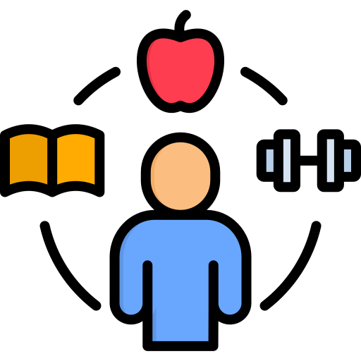

# Habit Tracker

Short description
-----------------

Habit Tracker is a client-side React app (TailwindCSS + Recharts) for creating, scheduling and tracking daily habits with calendar and streak views — fully local (localStorage), export/importable as JSON, and supports light/dark themes. No backend required.

---

Table of Contents
-----------------

- Features
- Quick demo
- Installation
- Development
- Project structure
- Data model
- How to use (A → Z)
- Export / Import
- Time / scheduledAt behavior
- Customization & theming
- Testing & build
- Deployment
- Troubleshooting
- Contributing
- License

---

Features
--------

- Create, edit and delete habits with a name and icon.
- Set an optional scheduled time for a habit (datetime picker).
- Track daily check-ins (yes/no toggle per day).
- Calendar view and streak calculation per habit.
- Animated progress charts using Recharts.
- Persists data in `localStorage` so data survives browser refresh.
- Dark / Light theme toggle.
- Export and import data as a downloadable `.json` backup.
- Mobile-first, responsive UI built with TailwindCSS.
- No login or backend — everything runs in the browser.

Quick demo / Screenshot
-----------------------

Add a short screenshot or GIF in this section for your repo README. Example:



Installation
------------

Prerequisites

- Node.js (>= 16 recommended)
- npm (or yarn)

Clone and setup

```bash
git clone <your-repo-url>
cd habit-tracker
npm install
```

Start the dev server

```bash
npm start
```

Build for production

```bash
npm run build
```

Project structure
-----------------

- `public/` — static assets and `index.html`.
- `src/` — app source code
  - `components/` — UI components (HabitForm, HabitCard, CalendarView, ProgressCharts, ThemeToggle)
  - `hooks/` — `useLocalStorage` and `useTheme` helpers
  - `utils/` — `dateUtils.js` helper functions
  - `App.js` — application root, routing-less view switching

Data model
----------

Habits are stored in localStorage under the key `habit-tracker-habits` (array). Each habit object has at least:

```json
{
  "id": "<string>",
  "name": "Read 30 minutes",
  "icon": "📚",
  "createdAt": "2025-08-16T08:12:34.567Z",
  "scheduledAt": "2025-08-16T08:00" // optional: datetime-local string
}
```

Completions are stored as an object keyed by habit id under `habit-tracker-completions`:

```json
{
  "habitId1": { "2025-08-15": true, "2025-08-16": false },
  "habitId2": { "2025-08-16": true }
}
```

Note on `scheduledAt`: the current implementation stores the raw `datetime-local` input value (e.g. `YYYY-MM-DDTHH:mm`). `createdAt` is stored as an ISO timestamp. See "Time / scheduledAt behavior" below.

How to use (A → Z)
-------------------

- Create a habit:
  - Click "Add New Habit".
  - Enter a name, pick an icon and optionally choose a scheduled datetime.
  - Click "Create Habit".

- Edit a habit:
  - Click the edit (pencil) icon on a habit card.
  - Change name/icon/scheduled time and click "Update".

- Delete a habit:
  - Click the trash icon on a habit card and confirm deletion. Completions for that habit are cleaned up.

- Track daily completion:
  - On each habit card click the large "Mark as Done" / "Completed Today" button to toggle completion for today.

- Calendar view:
  - Open the Calendar tab, select a habit, and view its monthly calendar (completed days are highlighted).

- Streaks & stats:
  - Each habit shows a streak computed from past completions. The analytics page shows charts powered by Recharts.

Export / Import
---------------

- Export data: Click the export button in the header — this downloads a JSON file with `habits`, `completions`, `exportDate` and `version` fields.
- Import data: Click the import button in the header and select a previously exported `.json` backup. Imported data replaces the current `habits` and `completions` (the app currently trusts the file structure). If you have older backups that lack `createdAt`, consider adding `createdAt` values to the objects post-import.

Time / `scheduledAt` behavior
-----------------------------

- `createdAt`: stored as an ISO string (e.g. `new Date().toISOString()`), suitable for exact timestamps and exports.
- `scheduledAt`: stored as the `datetime-local` input string (e.g. `2025-08-16T08:00`) — note this value does not include a timezone offset.

Implication: `scheduledAt` values reflect the user's local time when saved. If you plan to share/export across timezones or normalize timestamps, consider converting the input value to an ISO string (UTC) on save and converting back for editing with the helper in `src/utils/dateUtils.js`.

Customization & theming
-----------------------

- Tailwind: styles live in `src/App.css` and use Tailwind utility classes. Adjust `tailwind.config.js` to change theme colors.
- Theme toggle: `useTheme()` stores the theme in localStorage under `habit-tracker-theme` and toggles the `dark` class on the root element.
- Author link: Footer includes a small animated badge linking to the author site.

Testing, linting & build
------------------------

- The project is bootstrapped with Create React App.
- Run tests with:

```bash
npm test
```

- Build production bundle:

```bash
npm run build
```

Deployment
----------

- Recommended: Netlify, Vercel, or GitHub Pages. For Netlify or Vercel, push the repo and point the site to the built output (`npm run build`).

Troubleshooting & tips
----------------------

- If UI looks broken after editing CSS, run `npm run build` to ensure Tailwind directives are processed.
- If calendar or charts look empty, confirm `habits` and `completions` exist in localStorage. Use the app Export to create a backup and inspect its JSON.
- If scheduled times seem off across machines, it's due to `datetime-local` storing local time. See the Time section for normalization suggestions.

Recommended improvements (todo)
------------------------------

- Normalize `scheduledAt` to ISO (UTC) before saving, and convert back for editing.
- Make the icon grid responsive (`grid-cols-5 sm:grid-cols-10`) for better mobile layout.
- Add safety checks during import (schema validation) and add automatic migration for missing `createdAt`.
- Add optional browser notifications for scheduled habits.

Contributing
------------

Fork the repo, make changes, open a pull request with a clear description of your changes. Keep changes small and focused.

Author
------

Made by [Jijanur Rahman](https://jijanurrahman.netlify.app)

License
-------

This repository is available under the MIT License — include `LICENSE` file if you want to publish it publicly.

Acknowledgements
----------------

- Built with React, TailwindCSS and Recharts.
- Icons from lucide-react.
# Getting Started with Create React App

This project was bootstrapped with [Create React App](https://github.com/facebook/create-react-app).

## Available Scripts

In the project directory, you can run:

### `npm start`

Runs the app in the development mode.\
Open [http://localhost:3000](http://localhost:3000) to view it in your browser.

The page will reload when you make changes.\
You may also see any lint errors in the console.

### `npm test`

Launches the test runner in the interactive watch mode.\
See the section about [running tests](https://facebook.github.io/create-react-app/docs/running-tests) for more information.

### `npm run build`

Builds the app for production to the `build` folder.\
It correctly bundles React in production mode and optimizes the build for the best performance.

The build is minified and the filenames include the hashes.\
Your app is ready to be deployed!

See the section about [deployment](https://facebook.github.io/create-react-app/docs/deployment) for more information.

### `npm run eject`

**Note: this is a one-way operation. Once you `eject`, you can't go back!**

If you aren't satisfied with the build tool and configuration choices, you can `eject` at any time. This command will remove the single build dependency from your project.

Instead, it will copy all the configuration files and the transitive dependencies (webpack, Babel, ESLint, etc) right into your project so you have full control over them. All of the commands except `eject` will still work, but they will point to the copied scripts so you can tweak them. At this point you're on your own.

You don't have to ever use `eject`. The curated feature set is suitable for small and middle deployments, and you shouldn't feel obligated to use this feature. However we understand that this tool wouldn't be useful if you couldn't customize it when you are ready for it.

## Learn More

You can learn more in the [Create React App documentation](https://facebook.github.io/create-react-app/docs/getting-started).

To learn React, check out the [React documentation](https://reactjs.org/).

### Code Splitting

This section has moved here: [https://facebook.github.io/create-react-app/docs/code-splitting](https://facebook.github.io/create-react-app/docs/code-splitting)

### Analyzing the Bundle Size

This section has moved here: [https://facebook.github.io/create-react-app/docs/analyzing-the-bundle-size](https://facebook.github.io/create-react-app/docs/analyzing-the-bundle-size)

### Making a Progressive Web App

This section has moved here: [https://facebook.github.io/create-react-app/docs/making-a-progressive-web-app](https://facebook.github.io/create-react-app/docs/making-a-progressive-web-app)

### Advanced Configuration

This section has moved here: [https://facebook.github.io/create-react-app/docs/advanced-configuration](https://facebook.github.io/create-react-app/docs/advanced-configuration)

### Deployment

This section has moved here: [https://facebook.github.io/create-react-app/docs/deployment](https://facebook.github.io/create-react-app/docs/deployment)

### `npm run build` fails to minify

This section has moved here: [https://facebook.github.io/create-react-app/docs/troubleshooting#npm-run-build-fails-to-minify](https://facebook.github.io/create-react-app/docs/troubleshooting#npm-run-build-fails-to-minify)
